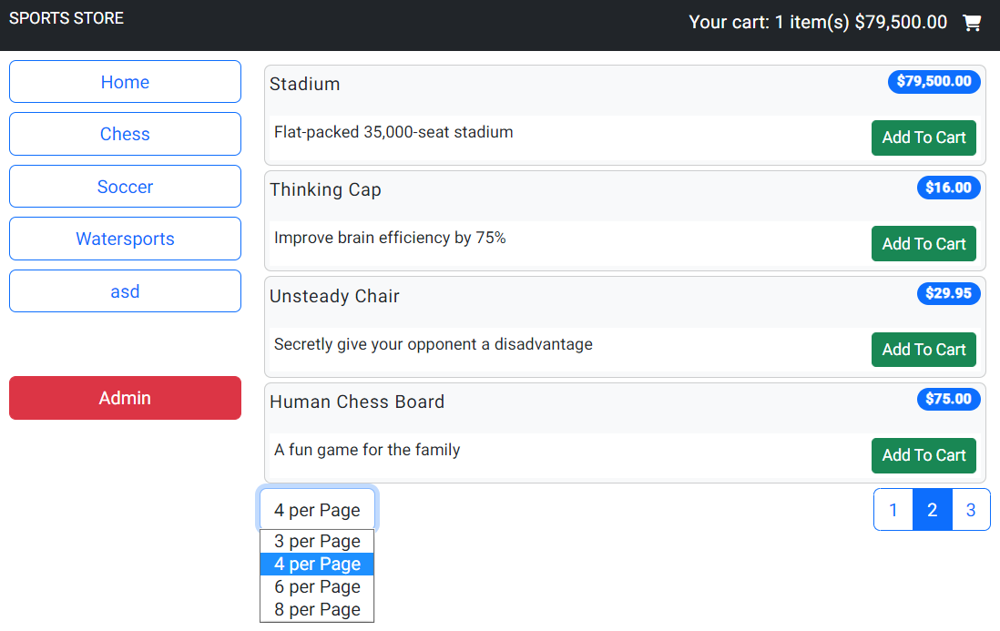
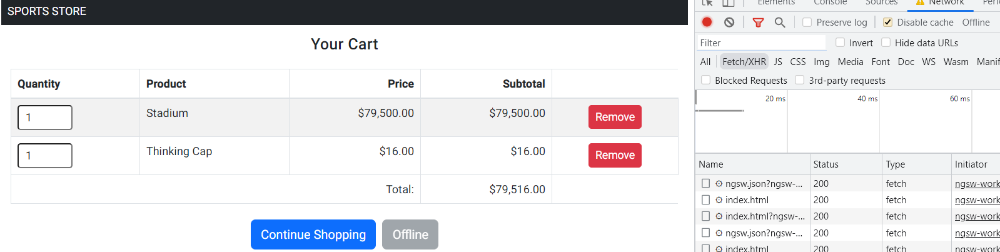
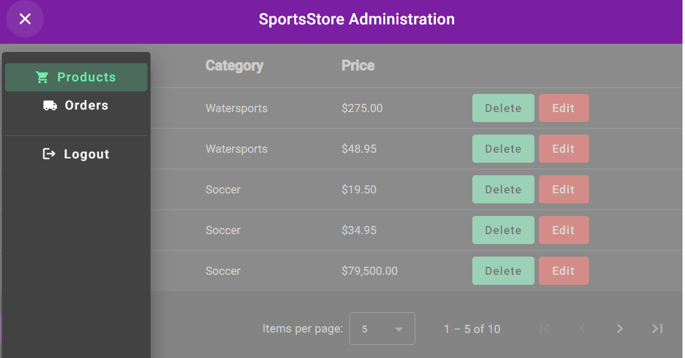

# Sports Store

This project was generated with [Angular CLI](https://github.com/angular/angular-cli) version 15.0.4.

## Features
- [x] mostly based on async pipe
- [x] custom pagination directive for main page
- [x] added service worker for **offline** shopping (use HTTPS with your own certs. Add `sports_store_cert.pem` and `sports_store_key.pem` to the `ssl` folder).
- [x] integrated admin panel

## Build
Run `ng build` to build the project. The build artifacts will be stored in the `dist/SportsStore` directory.

## Deploy
`docker build . -t sportsstore -f Dockerfile`

`docker run -p 80:80 -p 443:443 sportsstore`

